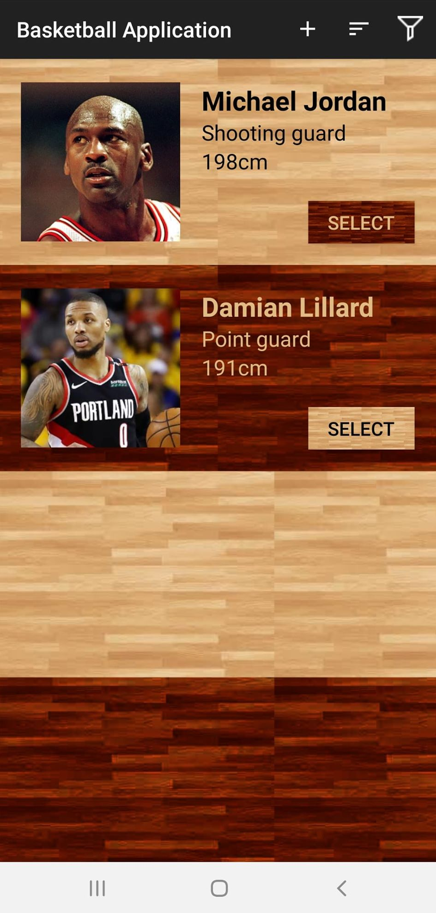
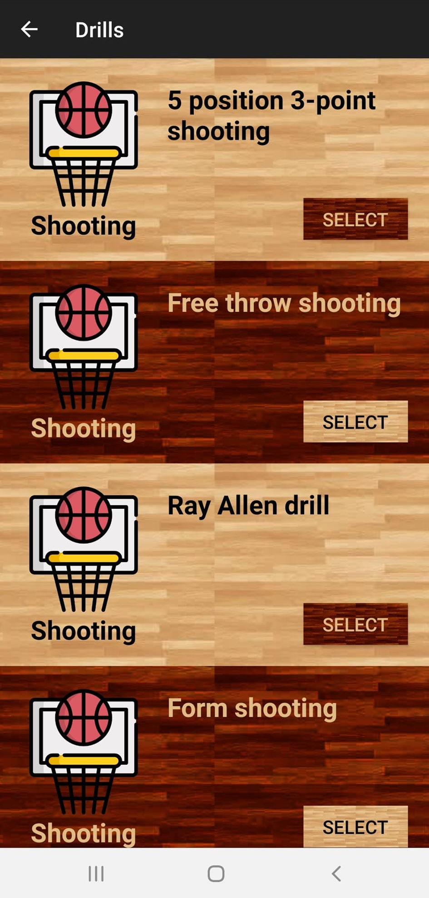
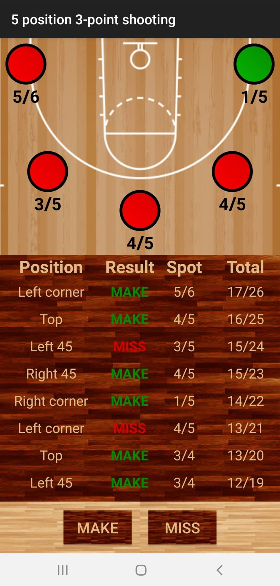

# Basketball Training App

Basketball Training App is an application designed for basketball players.

# Features

### Players list
If you are the coach you can list players you train and add new ones. 

### Drill list
Application offers you multiple drills, split into categories like shooting or dribbling. 

### Drill description
Every drill has attached description. You can read about proper technique and focus points of the drill.

### Training execution
Some drills allow you to start a training and store the results of it.  

### Progress charts
All your training results shown as a chart. You can look at your progress in time and also see single training summaries.